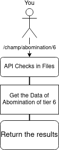

<div align="center">
    <h1>UMA (Unofficial MCOC API)</h1>
  <p align="center">
    
    
  </p>
</div>


## Overview

UMA is a API created for the developers who like and play MCOC(Marvel Contest of Champions).
It gives various information about champs like for ex- their PI, Prestige etc...

## URI(New)

The base URI for the API is now- `https://api.rexians.tk/` and all the requests are to be made on this.

## Working

The working of this API is kind-of different from others. Rather than always accessing from a Database, it has to choose whether to do the same or scrape from a website.
So, as UMA is in beta phase, It's database isn't still complete. Whenever a user requests data from the endpoints, the API checks if the information is available in the database, if it isn't, It actually live scrapes the data from the [auntm.ai website](https://auntm.ai/) and then sends you the information while putting it in the database too. Even though, This makes the API Slow, this is the best method I have come up with. 

A flow chart is shown below to explain it better-



## Endpoints

- ### champs

    - **Base URL**-> `https://api.rexians.tk/champs`

    - **Query Params**-> 
        - 1- `champ`
        - 2- `tier`
        - 2- `rank`

    - **Overview**
        - This endpoint is used to get basic information about champs like HP, Prestige etc...
        - The `champs` endpoint needs three query parameters- `champ` which is a specific code for each champ, `tier` which is the tier or star for the champ and the `rank` being the the rank of the champ.
        - The `champ` list can be found [here](champnames.md)
        - The `tier` should be from 1 to 6.
        - The `rank` varies according to the tier. 
            - 6* shouldn't have more than 4.
            - 5* shouldn't have more than 5.
            - 4* shouldn't have more than 4.
            - 3* shouldn't have more than 4.
            - 2* shouldn't have more than 3.
        - Ex. To get the info on 6 star Abomination of rank 3, the URI will be `https://api.rexians.tk/champs/?champ=abomination&tier=6&rank=3`

    - **Response**
        - Example of Successful response of 6 star Abomination(200 OK)
           - ```json
                    {
                    "name": "ABOMINATION",
                    "prestige": 8636,
                    "hp": 43600,
                    "attack": 3372,
                    "crit_rate": 351,
                    "crit_dmge": 538,
                    "armor": 572,
                    "block_prof": 2737,
                    "energy_resist": 0,
                    "physical_resist": 0,
                    "crit_resist": 0,
                    "sig_info": "Contact with the Abomination's gamma-irradiated body has a 5.29 to 25.03% chance to Poison the target, reducing their Health recovery by 30% and dealing 2697.6 Direct Damage over 12 seconds.",
                    "url_page": "https://auntm.ai/champions/abomination/tier/6",
                    "img_potrait": "https://auntm.ai/resources/ui/uigacha/featured/gachachaseprize_256x256_abomination.png",
                    "champid": "abomination+6+3",
                    "status": 200,
                    "detail": "Successful"
                    }
                ```
        - Example of Unsuccessful response(404 Not Found)
            - ```json
                {"detail":"404: Data with the champid: {champid} doesn't exist in the API Database!"}
              ```       

- ### find
    - **This route has been deprecated**
        - This route was deprecated as this used to live data scrape which was very much CPU consuming, So this feature has been removed for now. It might come in a upgraded way a later time.


# ROSTER

Roster is a new feature and cannot be controlled from only the API. So, A new method has been made for working with the roster. The Rexians website has a cool new feature which can be accessed from [**here**](https://mcoc.rexians.tk/login). After logging in, You will be redirected to your Profile where you will have a button to Add Champs. Click that, fill it and the data will be added the the Database. The data then can also be accessed from the following route(s) to work with.

- ## get
    - **BASE URI** -> `https://api.rexians.tk/roster/get` 

    - **Query Params**-> 
        - 1- `gamename`

    - **Overview**
        - This endpoint is used to get the information of a user who is registered in the [Rexians Web](https://mcoc.rexians.tk/login).
        - The `roster.get` endpoint needs one query parameters- `gamename` which is a gamename user specified while logging in for the first time in the Web.
        - Ex. To get the info on user of gamename: `The Indominus`, the URI will be `https://api.rexians.tk/roster/get?gamename=The Indominus`

    - **Response**
        - Example of Successful response of `The Indominus`(200 OK)
           - ```json
                {
                "game_name": "The Indominus",
                "discord_id": 706033276493758600,
                "avatar_url": "https://cdn.discordapp.com/avatars/706033276493758545/76219b3a57f0a57f52b72eeaf4ae89ab.png",
                "prestige": 7225,
                "roster": [
                    {
                    "champ_name": "HYPERION",
                    "tier": 5,
                    "rank": 5,
                    "prestige": 7225,
                    "sig_number": 100,
                    "img_link": "https://auntm.ai/resources/ui/uigacha/featured/gachachaseprize_256x256_hyperion.png",
                    "champid": "hyperion+100+5+5",
                    "url_page": "https://auntm.ai/champions/hyperion/tier/5"
                    }
                ],
                "status": 200,
                "detail": "Successful"
                }
                ```
        - Example of Unsuccessful response(404 Not Found)
            - ```json
                {"detail":"Player with this name doesn't exists."}
              ```      

## Contributing

For contribution guidelines please refer to the [Contributing.md](CONTRIBUTING.md)

